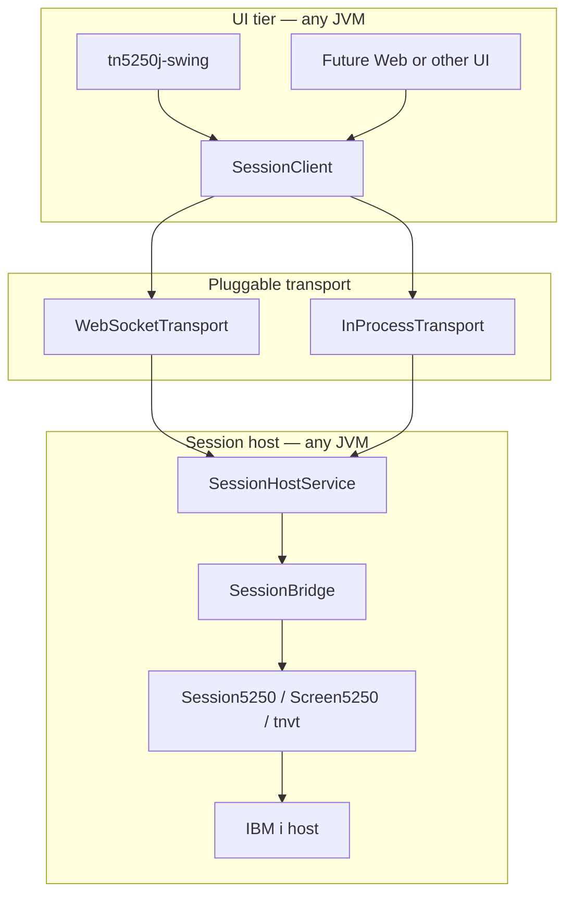

# TN5250J

A 5250 terminal emulator for IBM i (AS/400), written in Java. The desktop product provides a full Swing UI; the core engine can also run headless or host sessions for remote UIs over a WebSocket protocol.

Legacy user documentation: [tn5250j.github.io](https://tn5250j.github.io/)

Architecture (diagrams, deployment modes, protocol overview): [docs/ARCHITECTURE.md](docs/ARCHITECTURE.md)

## Module layout

The repository is a Maven multi-module project. Dependencies flow in one direction:

```
tn5250j-core
    ↑
tn5250j-session-api
    ↑
tn5250j-session-client ── tn5250j-session-server
    ↑                           ↑
    └──────── tn5250j-swing ────┘
              ↑
           tn5250j (product JAR)
```

| Module | Maven artifact | Documentation |
|--------|----------------|---------------|
| Core engine | `tn5250j-core` | [tn5250j-core/README.md](tn5250j-core/README.md) |
| Session contracts & wire protocol | `tn5250j-session-api` | [tn5250j-session-api/README.md](tn5250j-session-api/README.md) |
| Session client (local + remote) | `tn5250j-session-client` | [tn5250j-session-client/README.md](tn5250j-session-client/README.md) |
| Session server / gateway | `tn5250j-session-server` | [tn5250j-session-server/README.md](tn5250j-session-server/README.md) |
| Swing desktop UI | `tn5250j-swing` | [tn5250j-swing/README.md](tn5250j-swing/README.md) |
| Shaded desktop product | `tn5250j` | [tn5250j/README.md](tn5250j/README.md) |

## Architecture

Swing (and future UIs) talk to a **`SessionClient`**, not directly to `Session5250`. The same interface works in-process, on localhost, or over the network.



**Deployment modes**

| Mode | Description | Entry point |
|------|-------------|-------------|
| In-process (default) | Core and Swing in one JVM; zero wire overhead | `java -jar tn5250j-*.jar` |
| Local daemon | Core on one process, UI on another (same PC) | `-server` then `-remote ws://127.0.0.1:PORT` |
| Network gateway | Core near IBM i; UI remote over TLS | `SessionServerMain --bind 0.0.0.0` + `wss://` client |

See [tn5250j-session-api/README.md](tn5250j-session-api/README.md) for the v1 JSON/WebSocket protocol and [tn5250j-session-client/README.md](tn5250j-session-client/README.md) for client usage.

## Build

Requirements: Java 8+, Maven 3.6+

```bash
# Build and test all modules
mvn test

# Package (thin project JAR in tn5250j/target by default)
mvn package
```

### Shaded desktop JARs

Lean fat JAR (core deps only — no Jython, iText, BouncyCastle, Kunststoff):

```bash
mvn -Pshaded package
java -jar tn5250j/target/tn5250j-*.jar
```

Full fat JAR (includes optional features):

```bash
mvn -Pshaded-full package
java -jar tn5250j/target/tn5250j-*.jar
```

Maven Central release (`-Prelease`) publishes the lean shaded JAR. See [tn5250j/README.md](tn5250j/README.md) for artifact details.

### Optional feature dependencies

Add these only when you need the feature (also bundled in `-Pshaded-full`):

| Feature | Dependency |
|---------|------------|
| Macros / scripting | `org.python:jython-standalone:2.7.3` |
| Spool → PDF export | `com.lowagie:itext:2.1.7` (+ BouncyCastle 1.38 if required) |
| Kunststoff L&F | `com.incors:kunstoff-laf:2.0.2` |

## Running

### Default desktop

```bash
java -jar tn5250j/target/tn5250j-*.jar
```

Opens the Swing UI with sessions running in-process (same behavior as before the session-layer split).

### Session server

From the shaded JAR or `tn5250j-session-server` module:

```bash
java -jar tn5250j-*.jar -server --port 5250 --bind 127.0.0.1
# or
java -cp tn5250j-session-server/target/tn5250j-session-server-*.jar \
  org.tn5250j.session.server.SessionServerMain --port 5250
```

Options: `--bind`, `--port` (default 5250), `--token` (optional bearer token).

### Remote Swing UI

Connect the desktop client to a running session server:

```bash
java -jar tn5250j-*.jar -remote ws://127.0.0.1:5250 -remoteToken YOUR_TOKEN
```

IBM i credentials and session properties are sent in the `SessionOpen` wire message; the server owns the TN5250 socket in gateway mode. See [tn5250j-session-server/README.md](tn5250j-session-server/README.md).

## Library consumers

| Use case | Depend on |
|----------|-----------|
| Headless 5250 / embed core only | `tn5250j-core` |
| Build a custom UI with local sessions | `tn5250j-core` + `tn5250j-session-client` |
| Build a remote UI (web, JavaFX, etc.) | `tn5250j-session-api` + `tn5250j-session-client` |
| Host sessions for remote clients | `tn5250j-session-api` + `tn5250j-session-server` + `tn5250j-core` |

The **`SessionClient`** interface in [tn5250j-session-api](tn5250j-session-api/README.md) is the primary UI boundary. **`ScreenModel`** exposes screen geometry, planes, input, and events without leaking `Screen5250`.

## Testing

```bash
mvn test
```

- **Core:** TN5250 protocol, encoding, screen model (~106 tests)
- **Session API:** wire codec contract tests
- **Session client:** local adapter parity
- **Session server:** embedded WebSocket integration
- **Swing:** keyboard, event fanout, UI input (~24 tests)

Core test utilities are published as `tn5250j-core` test-jar for reuse in swing and session modules.

## History

Created to provide a Linux-capable 5250 emulator with continued-edit fields, GUI windows, and cursor-progression fields. Originally hosted on SourceForge; migrated to GitHub in 2016. Java was chosen for cross-platform portability (the “J” in TN5250J).
