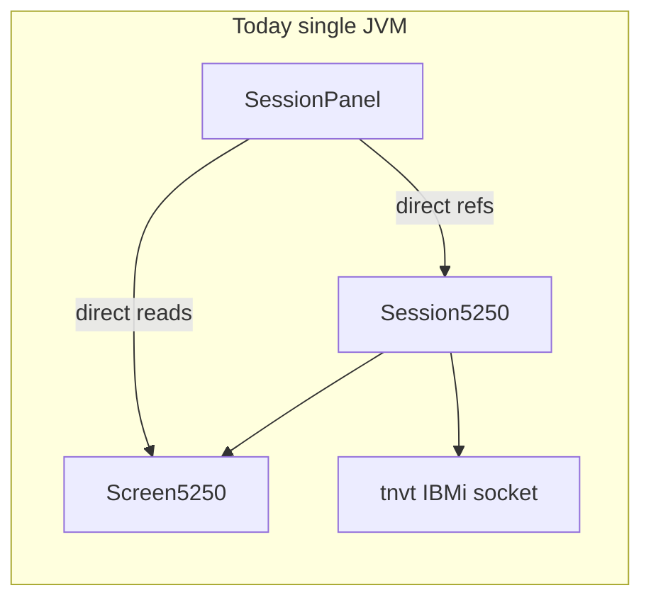
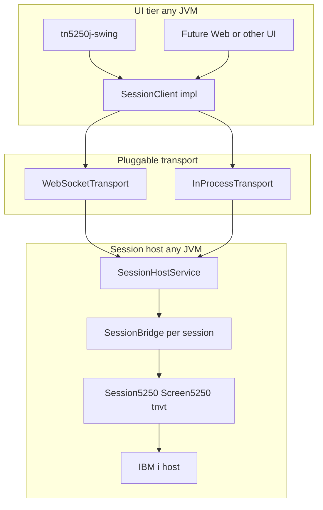
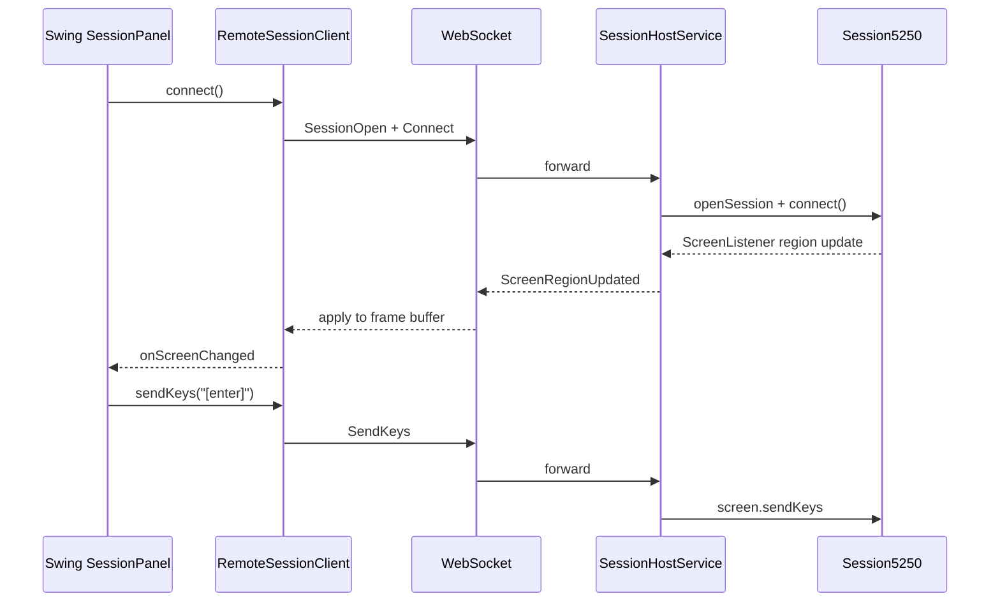

# Core–Swing Remote Session Architecture

> Mermaid diagrams below render on GitHub. In the Maven site (`mvn site -N`), they appear as source blocks.

TN5250J separates the **5250 engine** ([tn5250j-core](../tn5250j-core/README.md)) from **UI clients** via a shared [`SessionClient`](../tn5250j-session-api/README.md) API. The same interface works in-process, on localhost, or over the network using one JSON/WebSocket protocol ([session-api](../tn5250j-session-api/README.md)).

Module documentation: [project overview](../README.md) · [core](../tn5250j-core/README.md) · [session-api](../tn5250j-session-api/README.md) · [session-client](../tn5250j-session-client/README.md) · [session-server](../tn5250j-session-server/README.md) · [swing](../tn5250j-swing/README.md) · [product](../tn5250j/README.md)

## Goals

- UIs connect to core on the **same JVM**, **same PC**, or a **remote host**
- **One logical protocol** for all transports (no separate localhost binary format in v1)
- **Gateway mode:** core near IBM i; UI is display/input only
- **Desktop split:** core on one process, Swing on another (same machine or LAN)
- **v1 scope:** terminal essentials + extensible RPC for spool, transfer, macros (later)

## Before: direct coupling

`SessionPanel` held direct references to `Session5250` and `Screen5250`, read screen planes in-process, and called `session.getVT()` for connect, spool, and system request. `SessionController` / `SessionUiHooks` were a good **local** boundary but not a remote API.



## Target architecture



### Design principles

1. **UI talks to `SessionClient`, not `Session5250`.** Local and remote share one interface ([session-client](../tn5250j-session-client/README.md)).
2. **Server owns IBM i connectivity** in gateway mode; client sends config once via `SessionOpen`.
3. **Push screen/OIA events; RPC for input and lifecycle.** Reuses `ScreenListener` and `SessionListener` shapes from core.
4. **Bidirectional UI hooks** for SSL cert, SysReq, save prompts (`UiPromptRequest` / `UiPromptResponse`).
5. **Extensible RPC** for non-terminal features without bloating v1 wire messages.

### Module dependency rule

```
core ← session-api ← session-client / session-server ← swing ← product
```

## Remote session sequence

Typical WebSocket path: Swing → `RemoteSessionClient` → server → `Session5250` → IBM i.



**In-process fast path:** `InProcessTransport` / `LocalSessionClient` calls `SessionBridge` directly — same message types, no serialization ([session-client](../tn5250j-session-client/README.md)).

**Reconnection:** `SessionAttach` + `GetSnapshot` resync the client frame buffer after a WebSocket drop.

**Threading:** VT events on server VT thread → JSON → client WS thread → `SwingEdtDispatcher` on the UI (same EDT model as today).

## Deployment modes

| Mode | Use case | How |
|------|----------|-----|
| In-process | Default desktop | `java -jar tn5250j-0-SNAPSHOT.jar` |
| Local daemon | UI/core split, same PC | `--server` then `--remote ws://127.0.0.1:PORT` |
| Network gateway | Core near IBM i | `SessionServerMain --bind 0.0.0.0` + `wss://` client |

See [session-server](../tn5250j-session-server/README.md) for server CLI and [session-api](../tn5250j-session-api/README.md) for wire message types.

## Security (summary)

| Mode | Binding | Encryption | Auth |
|------|---------|------------|------|
| In-process | N/A | N/A | N/A |
| Local WS | `127.0.0.1` | Optional | `--token` bearer |
| Network gateway | Configurable | **TLS required** (`wss://`) | Bearer token / mTLS (future) |

IBM i credentials are sent once in `SessionOpen` over an encrypted channel; the server owns the TN5250 socket.

## Phased delivery

| Phase | Status | Contents |
|-------|--------|----------|
| 1 — API + in-process | Done | `session-api`, `LocalSessionClient`, Swing refactor |
| 2 — Wire + remote | Done | WebSocket protocol, server, `RemoteSessionClient`, `--server` / `--remote` |
| 3 — RPC extensions | Partial | `terminal.systemRequest`; spool/transfer pending |
| 4 — Additional UIs | Future | Web terminal consuming `session-api` only |

Command-line options and local setup: [CLI reference](CLI.md).

## Swing debug interface

For automation and diagnostics, the Swing desktop can expose a localhost HTTP API
(`--debug-interface`) that returns the rendered screen as text and accepts
keyboard/mouse input. This is independent of the WebSocket session-server protocol.
See [DEBUG-INTERFACE.md](DEBUG-INTERFACE.md).
